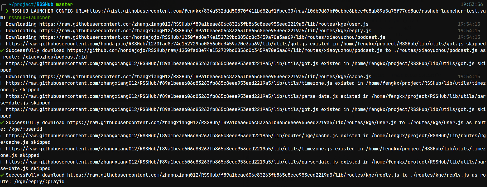

# RSSHub launcher

> Download external routes to RSSHub before launch

## Usage

### 安装

```shell
npm i -g rsshub-launcher
```

### 上传配置文件

编写一个配置 Yaml 文件，上传到可以提供 plain text 访问的 HTTPS 服务器上。例如 GitHub Gist。
文件包含包含一个 routes 列表，每一项包含路由 url 和路由挂载的`koa-router`path。
下面是一个[实例](https://github.com/fengkx/rsshub-launcher/blob/master/examples/example.yaml):

```yaml
routes:
  - remoteUrl: "https://raw.githubusercontent.com/zhangxiang012/RSSHub/f89a1beae606c83263fb865c8eee953eed2219a5/lib/routes/kge/user.js"
    routePath: "/kge/:userid"
  - remoteUrl: "https://raw.githubusercontent.com/zhangxiang012/RSSHub/f89a1beae606c83263fb865c8eee953eed2219a5/lib/routes/kge/reply.js"
    routePath: "/kge/reply/:playid"
  - remoteUrl: "https://github.com/hondajojo/RSSHub/raw/1230fad8e74e152729bc0856c0c3459a70e3aa69/lib/routes/xiaoyuzhou/podcast.js"
    routePath: "/xiaoyuzhou/podcast/:id"
```

remoteUrl 是路由入口(传入`koa-router`的文件)url,routePath 是其对应的 path。

### 运行

rsshub-launcher 会自动自动下载路由及其依赖文件(暂时不支持 npm 上的外部依赖)
需要将上一步的配置文件 url 传入`RSSHUB_LAUNCHER_CONFIG_URL`环境变量，然后在`RSSHub`Git repository 根目录运行`rsshub-launcher`。也可以通过`--root`选项指定根目录`。


