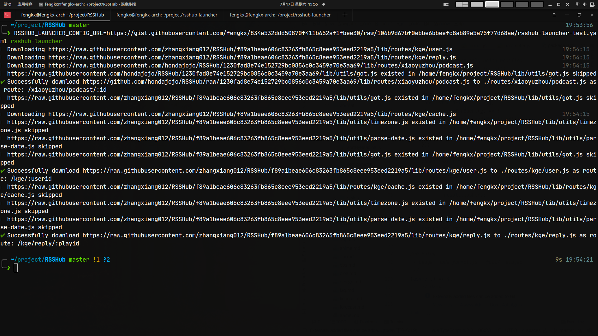

# RSSHub launcher

> Download external routes to RSSHub before launch

## Usage

### 安装

```shell
npm i -g rsshub-launcher
```

### 上传配置文件

编写一个配置 Yaml 文件，上传到可以提供 plain text 访问的 HTTPS 服务器上。例如 GitHub Gist。
文件包含包含一个 routes 列表，有两种配置方式

1. 直接传入 PR 的网址作为 prUrl
2. 传入路由入口(传入`koa-router`的文件)url 作为 remoteUrl 和路由挂载的`koa-router`path 作为 routePath。
   下面是一个[实例](https://github.com/fengkx/rsshub-launcher/blob/master/examples/example.yaml):

```yaml
routes:
  - remoteUrl: "https://raw.githubusercontent.com/zhangxiang012/RSSHub/f89a1beae606c83263fb865c8eee953eed2219a5/lib/routes/kge/user.js"
    routePath: "/kge/:userid"
  - remoteUrl: "https://raw.githubusercontent.com/zhangxiang012/RSSHub/f89a1beae606c83263fb865c8eee953eed2219a5/lib/routes/kge/reply.js"
    routePath: "/kge/reply/:playid"
  - remoteUrl: "https://github.com/hondajojo/RSSHub/raw/1230fad8e74e152729bc0856c0c3459a70e3aa69/lib/routes/xiaoyuzhou/podcast.js"
    routePath: "/xiaoyuzhou/podcast/:id"
  - prUrl: https://github.com/DIYgod/RSSHub/pull/7885
```

### 运行

rsshub-launcher 会自动自动下载路由及其依赖文件(暂时不支持 npm 上的外部依赖)
需要将上一步的配置文件 url 传入`RSSHUB_LAUNCHER_CONFIG_URL`环境变量，然后在`RSSHub`Git repository 根目录运行`rsshub-launcher`。也可以通过`--root`选项指定根目录。
你还可以通过`override`设置是否覆盖已经存在的文件。

```shell
Positionals:
  --root  File Path to RSSHub repository root
                             [字符串] [默认值: "."]

选项：
  --help      显示帮助信息                                                        [布尔]
  --version   显示版本号                                                         [布尔]
  --override  Whether override existed file                    [布尔] [默认值: false]

```


